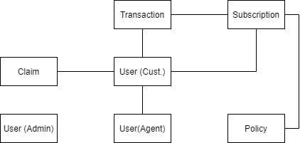

# Warehouse Management System

## Instruction

### Pull

1. Clone repository ini
2. Copy file `.env.example` ke `.env`
3. Edit file .env > `DB_DATABASE = insurance`
3. Run `php artisan migrate:fresh`
4. Run `git checkout -b pbiX` > X diganti angka
5. Cari file yang harus diedit: `ctrl + shift + f` > masukin `Nama` > edit file

### Push

1. Run `git add .`
2. Run `git commit -m "Commit Message"`
3. Run `git push origin nama`

### Pembagian Tugas S1

| Nama    | Task                    | PBI |
| ------- | ----------------------- | --- |
| cantika | Claim (2)               |	1		|
| fildzah | Dashboard (3)           | 2		|
| dila    | Subscription (5)        |	3		|
| rudi    | Policy (4)              |	4		|
| ghufron | Checkout (1)	          |	6		|

## Tasks

1. Edit file migrations di folder `/database/migrations`
2. Edit file model di folder `/app/Models`
3. Edit file view di folder `/resources/views/`
4. Edit file di folder `/routes`
5. Edit file controller di folder `/app/Htpp/Controllers`

### ERD

_Ga harus 100% sama kayak ERD, boleh ditambah / dikurang._

### Penjelasan

1. `User (Cust.)`
- dapat liat daftar polis yang tersedia (`Policy`)
- dapat mendaftar polis (`Subscription`)
- dapat membuat klaim sesuai polis yang dipunya (`Claim`)

2. `User (Admin)`
- dapat menerima/menolak pendaftaran polis (`Subscription`)
- CRUD `Policy`
3. `User (Agent)`: TBD